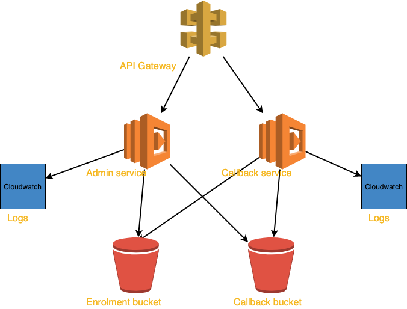

ACWIC Aged Care Provider Integration Microservices
==================================================

There is on of two suites of microservices.
This provides the API endpoints operated by Aged Care Providers,
so they can administer their enrolments with Training Providers
and so they can process data sent to them by Training Providers.

The code for this site is hosted at
https://github.com/ACWIC/employer-coordinator

The compliment to this suite is one for Training Providers,
documented at https://acwic-training-provider-coordinator.readthedocs.org

diagram: this one coloured (other one grey)

The purpose of this repository is to demonstrate
how the suite of microservices can be hosted.
Two methods are supported:

* Using docker-compose.
  Fully self-contained (including backing services).
  Actively used for development and testing,
  also an example of how it might be deployed
  in any container-hosting environment.
* Using Amazon Web Services (AWS).
  Specifically; AWS Lambda (serverless compute platform),
  using an API Gateway and S3 storage service.
  This is an example of hosting the system
  using cost-effective utility infrastructure.

The README file at
https://github.com/ACWIC/employer-coordinator/blob/main/README.md
contains technical documentation on these deployment scenarios.

The AWS deployment demonstrates how the system can be hosted
with at negligible operating cost.
In this configuration,
annual operating cost for a SME Aged Care Provider
would be approximately equivalent to one cup of coffee
(if not entirely free,
likely to fit within the constraints of AWS Free Tier).

Large scale employers
are likely to need sophisticated integration
with existing LMS/HRMS systems.
In that situation, these microservices could be used as a proxy layer
or equivalent endpoints could be surfaced on existing systems.
The purpose of supporting interoperability through standaisation
is served either way.

Components
----------

The microservice suite is provided by two components.

* **Admin Service**,
  used by Aged Care Providers
  to manage cross references
  and access data provided to them by Training Providers.
  This service is not public,
  it's a suggested interface.
  Pragmatically, existing systems
  may have more convenient ways
  to achieve the same ends.
* **Callback Handler**,
  used by the Training Provider
  to send information to the Aged Care Provider.
  This is a critical interoperability standard.
  
.. uml:: architecture.uml

Each of these components has an open-source reference implementation
that demonstrates the API using a low-cost object-store backing service.

The AWS sample deployment uses API Gateway (security/orchestration),
S3 (storage), cloudwatch (logging) and lambda (serverless compute)
services, using the provider-agnostic `serverless` framework
for packaging and deployment.

Admin Service
^^^^^^^^^^^^^

Documentation https://acwic-employer-admin.readthedocs.org

Source Code: https://github.com/ACWIC/employer-admin

Live Endpoints:

* Development https://prekb2sflh.execute-api.us-east-1.amazonaws.com/prod/cb/docs
* POC - TBA

Callback Service
^^^^^^^^^^^^^^^^

Documentation: https://acwic-employer-callback.readthedocs.org

Source Code: https://github.com/ACWIC/employer-callback

Live Endpoints:

* Development https://ngkkz39vx8.execute-api.us-east-1.amazonaws.com/dev/cb/docs
* POC https://prekb2sflh.execute-api.us-east-1.amazonaws.com/prod/cb/docs
